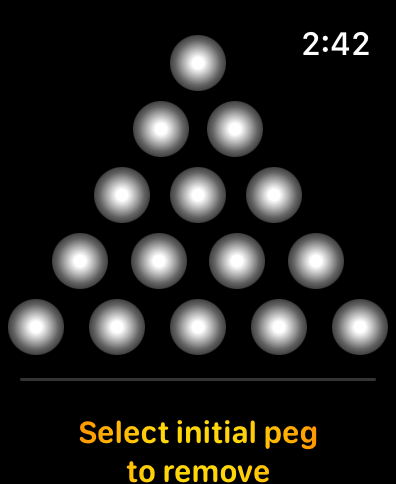
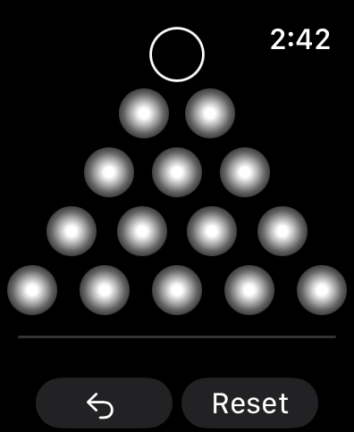
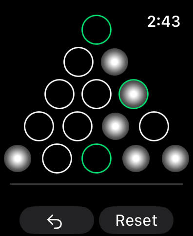
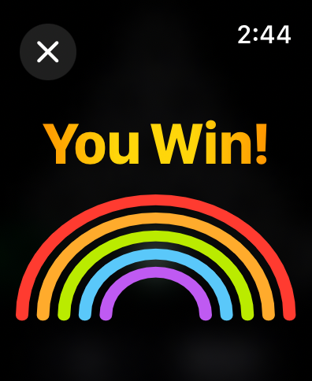
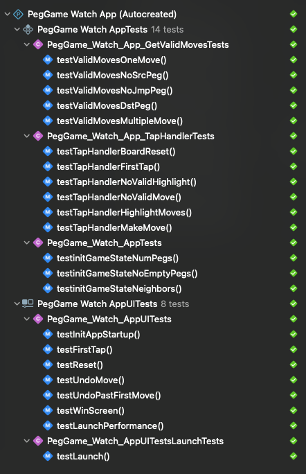

# watch-peg-game

###### Tags: Swift, SwiftUI, watchOS, XCTest, XCUITest
 

The Cracker Barrel golf tee puzzle is a classic brain teaser that involves arranging 15 golf tees (or pegs) in an equilateral triangle on a board. One peg is then removed creating an available hole.  The goal is to jump over each peg with another peg, removing the jumped-over peg, until only one remains. 

Here, we recreate this puzzle on the Apple Watch with SwiftUI 5.

## Screenshots

 
 

## Automated Tests
Included are a number of unit, performance, and UI tests using XCTest.

